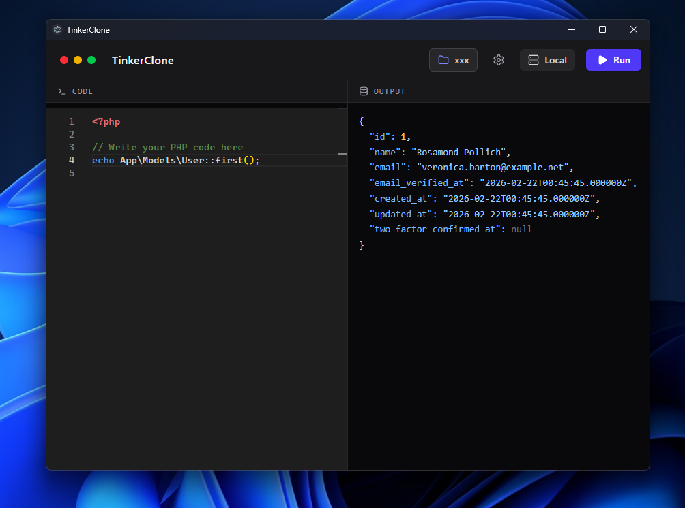

# 🔧 TinkerClone

> ⚠️ **Disclaimer:** This is an **experimental/educational clone** built for learning and testing purposes only. It is **not affiliated with or endorsed by [Tinkerwell](https://tinkerwell.app/)** — all credit for the original concept and product goes to the talented team at **Beyond Code** who built Tinkerwell.

---

A desktop PHP REPL (Read-Eval-Print Loop) inspired by [Tinkerwell](https://tinkerwell.app/). Run PHP code snippets locally or against any Laravel project — directly from a beautiful, modern editor.

Built with **Electron + React + Vite + Monaco Editor**.

---

## ✨ Features

| Feature | Description |
|---|---|
| 🖊️ **Monaco Editor** | The same editor that powers VS Code — with PHP syntax highlighting, line numbers, and bracket matching |
| ⚡ **PHP Autocomplete** | Built-in suggestions for PHP keywords, built-in functions, and Laravel helpers (Eloquent, DB, auth, request…) |
| 🚀 **Instant PHP Execution** | Write code, press **Run** — output appears immediately |
| 🏗️ **Laravel Project Support** | Select your project folder to automatically load `vendor/autoload.php` and bootstrap the full Laravel framework context |
| 🗃️ **MySQL / DB Support** | Full access to Laravel's database layer — Eloquent models, query builder, and raw SQL |
| 🌐 **SSH Remote Execution** | Connect to a remote server via SSH and run PHP code on it directly from TinkerClone |
| 🎨 **JSON Output Viewer** | Results are automatically parsed and rendered as pretty-printed, color-coded JSON |
| 🔒 **Electron Desktop App** | Runs as a native desktop application on Windows, macOS, and Linux |

---

## 📸 Preview



> Running `App\Models\User::first()` against a real Laravel database — output rendered as color-coded JSON.

---

## 🚀 Getting Started

### Requirements

- [Node.js](https://nodejs.org/) 18+
- [PHP](https://www.php.net/) (available in your system PATH)
- A Laravel project (optional, for Eloquent/DB features)

### Installation

```bash
git clone https://github.com/bo3bdo/tinkerclone.git
cd tinkerclone
npm install
npm run dev
```

### Build for Production

```bash
# Windows installer (.exe)
npm run build:win

# macOS
npm run build:mac

# Linux
npm run build:linux
```

---

## 🗂️ Project Structure

```
src/
├── main/           # Electron main process (PHP execution engine, SSH, IPC)
├── preload/        # Context bridge for secure IPC
└── renderer/
    └── src/
        ├── App.tsx              # Main layout and state
        └── components/
            ├── JsonOutput.tsx   # Color-coded JSON viewer
            └── SettingsModal.tsx # SSH & MySQL settings form
```

---

## 🔌 How It Works

1. You write PHP code in the Monaco editor
2. Press **Run** → the code is sent via Electron IPC to the main process
3. The main process writes a temporary `.php` file to your OS temp directory
4. If a project is selected, it prepends `require autoload.php` + bootstraps the Laravel app
5. Executes `php <tempfile>` via Node.js `child_process`
6. Output (stdout/stderr) is returned and rendered in the output panel as JSON

---

## 🤝 Credits

- **Original concept & product:** [Tinkerwell by Beyond Code](https://tinkerwell.app/) — a paid, polished tool every PHP developer should own.
- **This clone:** Built as an open-source educational experiment to understand how such tools are architected.

---

## ⚖️ License

MIT — for educational purposes only.
